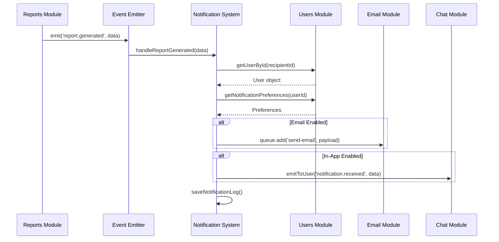
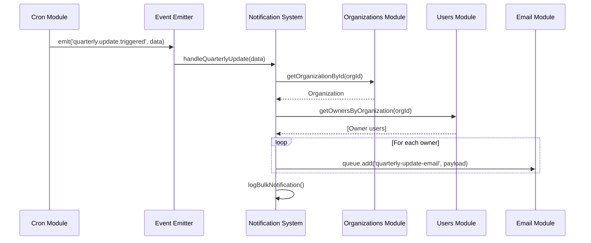
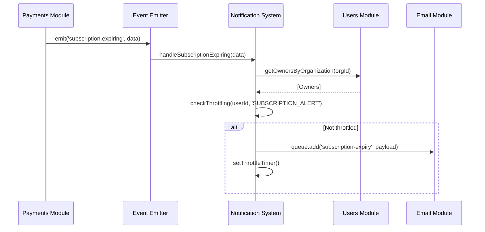

# Module Interactions - Notification System

## Overview

This document describes how the Notification System module interacts with other internal modules in the PlanetsHR monolithic application.

## Internal Module Dependencies

### Direct Dependencies

| Module | Purpose | Interaction Type |
|--------|---------|------------------|
| **Auth Module** | User authentication context | Synchronous |
| **Users Module** | User preferences and contact info | Synchronous |
| **Organizations Module** | Company and branch context | Synchronous |
| **Employees Module** | Employee data for notifications | Synchronous |
| **Reports Module** | Report generation events | Event-driven |
| **Payments Module** | Subscription status events | Event-driven |
| **Email Module** | Email delivery service | Asynchronous (Queue) |
| **Chat Module** | Real-time WebSocket delivery | Event-driven |
| **Cron Module** | Scheduled notification triggers | Event-driven |

### Dependency Graph

```
Notification System
├── Consumes Events From:
│   ├── Reports Module (report.generated, report.regenerated)
│   ├── Payments Module (subscription.renewed, subscription.expiring, payment.failed)
│   ├── Cron Module (quarterly.update.triggered)
│   ├── Employees Module (employee.created, employee.updated)
│   ├── Organizations Module (organization.created, department.created)
│   └── Users Module (user.created, user.role.changed)
│
├── Queries Data From:
│   ├── Users Module (user preferences, contact info, roles)
│   ├── Organizations Module (company settings, hierarchy)
│   └── Employees Module (employee details for context)
│
└── Triggers Services:
    ├── Email Module (send email notifications)
    └── Chat Module (emit WebSocket notifications)
```

## Communication Patterns

### 1. Event-Driven Communication

The Notification System primarily uses NestJS EventEmitter for asynchronous, decoupled communication.

#### Event Subscription Pattern

```typescript
// notification-event.listener.ts
@Injectable()
export class NotificationEventListener {
  constructor(
    private readonly notificationService: NotificationService,
  ) {}

  @OnEvent('report.generated')
  async handleReportGenerated(payload: ReportGeneratedEvent) {
    await this.notificationService.sendReportNotification({
      reportId: payload.reportId,
      employeeId: payload.employeeId,
      recipientUserId: payload.requestedBy,
      type: 'REPORT_GENERATED',
    });
  }

  @OnEvent('subscription.expiring')
  async handleSubscriptionExpiring(payload: SubscriptionExpiringEvent) {
    await this.notificationService.sendSubscriptionAlert({
      organizationId: payload.organizationId,
      daysRemaining: payload.daysRemaining,
      type: 'SUBSCRIPTION_EXPIRING',
    });
  }
}
```

#### Event Emission from Other Modules

```typescript
// reports.service.ts (Reports Module)
@Injectable()
export class ReportsService {
  constructor(private eventEmitter: EventEmitter2) {}

  async generateReport(employeeId: string, userId: string) {
    const report = await this.createReport(employeeId);
    
    // Emit event for notification system
    this.eventEmitter.emit('report.generated', {
      reportId: report.id,
      employeeId,
      requestedBy: userId,
      timestamp: new Date(),
    });
    
    return report;
  }
}
```

### 2. Direct Service Injection

For synchronous data retrieval, the Notification System injects other module services.

```typescript
// notification.service.ts
@Injectable()
export class NotificationService {
  constructor(
    private readonly usersService: UsersService,
    private readonly organizationsService: OrganizationsService,
    private readonly employeesService: EmployeesService,
  ) {}

  async sendReportNotification(data: NotificationData) {
    // Fetch user preferences
    const user = await this.usersService.findById(data.recipientUserId);
    const preferences = await this.usersService.getNotificationPreferences(user.id);
    
    // Fetch organization context
    const organization = await this.organizationsService.findById(user.organizationId);
    
    // Apply role-based filtering
    if (this.shouldSendNotification(user, preferences, data)) {
      await this.dispatchNotification(user, data);
    }
  }
}
```

### 3. Queue-Based Communication

The Notification System uses BullMQ queues for email delivery through the Email Module.

```typescript
// notification.service.ts
@Injectable()
export class NotificationService {
  constructor(
    @InjectQueue('email') private emailQueue: Queue,
  ) {}

  async dispatchEmailNotification(recipient: User, notification: Notification) {
    await this.emailQueue.add('send-notification', {
      to: recipient.email,
      template: notification.template,
      context: notification.context,
      priority: notification.priority,
    });
  }
}
```

### 4. WebSocket Real-Time Delivery

Integration with Chat Module for real-time in-app notifications.

```typescript
// notification.service.ts
@Injectable()
export class NotificationService {
  constructor(
    private readonly chatGateway: ChatGateway, // Injected from Chat Module
  ) {}

  async sendInAppNotification(userId: string, notification: Notification) {
    // Emit WebSocket event to connected client
    this.chatGateway.emitToUser(userId, 'notification.received', {
      id: notification.id,
      type: notification.type,
      title: notification.title,
      message: notification.message,
      timestamp: notification.createdAt,
      priority: notification.priority,
    });
  }
}
```

## Shared Resources

### 1. MongoDB Collections

#### Shared with Users Module
- **users** collection: Read access for user contact info and preferences
- **notification_preferences** collection: Managed by Notification System, referenced by Users Module

#### Shared with Organizations Module
- **organizations** collection: Read access for company settings
- **notification_settings** (org-level): Company-wide notification rules

### 2. Redis Resources

#### Queue Management
```typescript
// Shared BullMQ queues
{
  'email': {
    owner: 'Email Module',
    producer: 'Notification System',
    consumer: 'Email Module',
  },
  'notification': {
    owner: 'Notification System',
    producer: 'Multiple modules',
    consumer: 'Notification System',
  },
}
```

#### Cache Keys
```typescript
// Notification-related cache patterns
{
  'notification:preferences:{userId}': 'User notification preferences',
  'notification:throttle:{userId}:{type}': 'Rate limiting state',
  'notification:unread:{userId}': 'Unread count cache',
  'notification:digest:{userId}': 'Pending digest notifications',
}
```

### 3. Event Bus

Shared NestJS EventEmitter2 instance across all modules.

#### Events Consumed by Notification System

| Event Name | Source Module | Payload Structure |
|------------|---------------|-------------------|
| `report.generated` | Reports | `{ reportId, employeeId, requestedBy, timestamp }` |
| `report.regenerated` | Cron | `{ reportId, employeeId, quarter, harmonic_code_changed }` |
| `subscription.renewed` | Payments | `{ organizationId, subscriptionId, nextBillingDate }` |
| `subscription.expiring` | Payments | `{ organizationId, subscriptionId, daysRemaining }` |
| `payment.failed` | Payments | `{ organizationId, subscriptionId, reason, retryDate }` |
| `quarterly.update.triggered` | Cron | `{ organizationId, employeeIds[], quarter }` |
| `employee.created` | Employees | `{ employeeId, createdBy, departmentId }` |
| `user.created` | Users | `{ userId, role, organizationId }` |
| `user.role.changed` | Users | `{ userId, oldRole, newRole, changedBy }` |

#### Events Emitted by Notification System

| Event Name | Consumer Modules | Purpose |
|------------|------------------|---------|
| `notification.sent` | Analytics (future) | Track notification delivery |
| `notification.failed` | Logging | Error tracking and retry |
| `notification.read` | Analytics (future) | User engagement tracking |

## Module Interaction Flows

### Flow 1: Report Generation Notification



### Flow 2: Quarterly Update Notification



### Flow 3: Subscription Expiry Notification



## Data Access Patterns

### Read-Only Access

The Notification System has read-only access to:
- User profiles (Users Module)
- User roles and permissions (Auth Module)
- Organization structure (Organizations Module)
- Employee details (Employees Module)
- Report metadata (Reports Module)

### Write Access

The Notification System manages its own data:
- Notification logs (MongoDB: `notifications` collection)
- Notification preferences (MongoDB: `notification_preferences` collection)
- Delivery status tracking (MongoDB: embedded in notification documents)

### Shared Write Access

- **Redis cache**: Multiple modules read/write notification-related cache keys
- **Event bus**: Multiple modules emit events consumed by Notification System

## Cross-Cutting Concerns

### 1. Role-Based Access Control

Notification System respects RBAC rules from Auth Module:

```typescript
async sendNotification(userId: string, notification: Notification) {
  const user = await this.usersService.findById(userId);
  
  // Validate user has permission to receive this notification type
  const hasPermission = await this.authService.checkPermission(
    user,
    `notification:receive:${notification.type}`,
  );
  
  if (!hasPermission) {
    this.logger.warn(`User ${userId} lacks permission for notification ${notification.type}`);
    return;
  }
  
  await this.dispatchNotification(user, notification);
}
```

### 2. Multi-Tenancy Isolation

Notifications respect organization boundaries:

```typescript
async getNotifications(userId: string, filters: NotificationFilters) {
  const user = await this.usersService.findById(userId);
  
  // Ensure notifications are scoped to user's organization
  const notifications = await this.notificationModel.find({
    recipientId: userId,
    organizationId: user.organizationId, // Tenant isolation
    ...filters,
  });
  
  return notifications;
}
```

### 3. Error Handling Coordination

Failed notifications trigger events for centralized error handling:

```typescript
async handleNotificationFailure(error: Error, notification: Notification) {
  // Log to centralized error tracking
  this.eventEmitter.emit('notification.failed', {
    notificationId: notification.id,
    error: error.message,
    timestamp: new Date(),
  });
  
  // Attempt retry logic (managed by queue system)
  await this.retryNotification(notification);
}
```

## Performance Considerations

### 1. Batch Processing

Bulk notifications use efficient batching:

```typescript
async sendBulkNotifications(recipients: User[], notification: NotificationTemplate) {
  const batchSize = 50;
  const batches = chunk(recipients, batchSize);
  
  for (const batch of batches) {
    await Promise.all(
      batch.map(user => this.sendNotification(user.id, notification))
    );
  }
}
```

### 2. Caching Strategy

User preferences cached to reduce database queries:

```typescript
async getUserPreferences(userId: string): Promise<NotificationPreferences> {
  const cacheKey = `notification:preferences:${userId}`;
  
  let preferences = await this.cacheManager.get<NotificationPreferences>(cacheKey);
  
  if (!preferences) {
    preferences = await this.notificationPreferencesModel.findOne({ userId });
    await this.cacheManager.set(cacheKey, preferences, 3600); // 1 hour TTL
  }
  
  return preferences;
}
```

### 3. Throttling Coordination

Rate limiting shared across modules via Redis:

```typescript
async checkThrottle(userId: string, notificationType: string): Promise<boolean> {
  const throttleKey = `notification:throttle:${userId}:${notificationType}`;
  const count = await this.redis.incr(throttleKey);
  
  if (count === 1) {
    await this.redis.expire(throttleKey, 3600); // 1 hour window
  }
  
  const limit = this.getThrottleLimit(notificationType);
  return count <= limit;
}
```

## Testing Considerations

### Integration Test Patterns

```typescript
describe('Notification System Integration', () => {
  it('should send notification when report is generated', async () => {
    // Arrange
    const mockUser = await createTestUser();
    const mockEmployee = await createTestEmployee();
    
    // Act
    eventEmitter.emit('report.generated', {
      reportId: 'report-123',
      employeeId: mockEmployee.id,
      requestedBy: mockUser.id,
    });
    
    // Assert
    await waitFor(() => {
      expect(emailQueue.add).toHaveBeenCalledWith('send-notification', 
        expect.objectContaining({
          to: mockUser.email,
          template: 'report-generated',
        })
      );
    });
  });
});
```

**Document Version:** 1.0  
**Last Updated:** 2025-11-11  
**Status:** Complete